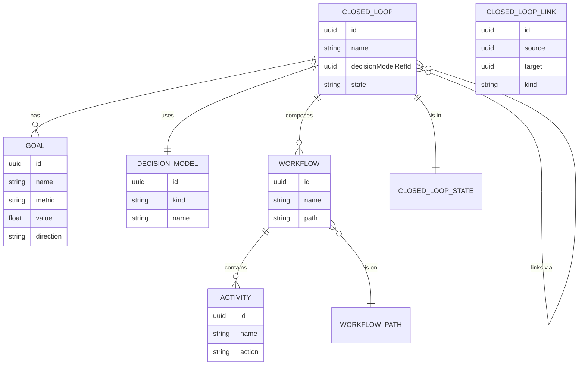

# CLAM Entity Relationship

```mermaid
erDiagram
    CLOSED_LOOP ||--o{ GOAL : "has"
    CLOSED_LOOP ||--|| DECISION_MODEL : "uses"
    CLOSED_LOOP ||--o{ WORKFLOW : "composes"
    CLOSED_LOOP }o--o{ CLOSED_LOOP : "links via"
    WORKFLOW ||--o{ ACTIVITY : "contains"
    WORKFLOW }o--|| WORKFLOW_PATH : "is on"
    CLOSED_LOOP ||--|| CLOSED_LOOP_STATE : "is in"

    CLOSED_LOOP {
        uuid id
        string name
        uuid decisionModelRefId
        string state
    }
    DECISION_MODEL {
        uuid id
        string kind
        string name
    }
    GOAL {
        uuid id
        string name
        string metric
        float value
        string direction
    }
    WORKFLOW {
        uuid id
        string name
        string path
    }
    ACTIVITY {
        uuid id
        string name
        string action
    }
    CLOSED_LOOP_LINK {
        uuid id
        uuid source
        uuid target
        string kind
    }
```

Source: `docs/diagrams/src/entities.mmd`.